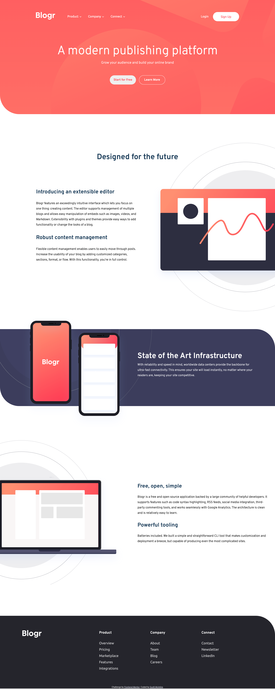

# Frontend Mentor - Blogr landing page solution

This is a solution to the [Blogr landing page challenge on Frontend Mentor](https://www.frontendmentor.io/challenges/blogr-landing-page-EX2RLAApP). Frontend Mentor challenges help you improve your coding skills by building realistic projects. 

## Table of contents

- [Overview](#overview)
  - [The challenge](#the-challenge)
  - [Screenshot](#screenshot)
  - [Links](#links)
- [My process](#my-process)
  - [Built with](#built-with)
  - [What I learned](#what-i-learned)
  - [Continued development](#continued-development)
  - [Useful resources](#useful-resources)
- [Author](#author)

**Note: Delete this note and update the table of contents based on what sections you keep.**

## Overview

### The challenge

Users should be able to:

- View the optimal layout for the site depending on their device's screen size
- See hover states for all interactive elements on the page

### Screenshot



### Links

- Solution URL: [https://ldg.github.io/blogr-challenge/](https://ldg.github.io/blogr-challenge/)

## My process

### Built with

- Semantic HTML5 markup
- BEM naming convention
- CSS custom properties
- SASS
- Flexbox
- CSS Grid
- Mobile-first workflow


### What I learned

This was my first attempt to use BEM *(Block,Element,Modifier)* css naming for my HTML. I found it was really helpful for keeping the HTML structure in mind when writing out the markup. I think sometimes it gets a bit confusing because of the longer names, but I think I'll continue using it. I think once I've built more projects with BEM I'll be more comfortable with it.

I learned a lot about Javascript on this project. In building out the menubar functionality, I used JS to toggle CSS classes on navigation elements to create the mobile menu toggle. One specific challenge I overcame was working with querySelectorAll(). I was having difficulty figuring out how to loop through the results of the query selector. In my research to figure out what I was doing wrong I learned that ```querySelectorAll()``` returns a ```NodeList```, not an ```array```, which was why all my attempts to use the ```forEach()``` method kept failing. Once I realize this I discovered the ```Array.from()``` function would convert my NodeList to an array, and that would allow me to successfully use the ```forEach()``` method.

### Continued development

I plan on focusing more on Javascript since it is so fundemental to frontend development. Once I feel more confident I'll start focusing on React. 

### Useful resources

- [BEM css](https://ldg.github.io/blogr-challenge/) - The official BEM website. 
- [Go Make Things](https://gomakethings.com/converting-a-nodelist-to-an-array-with-vanilla-javascript/) - Chris Ferdinandi's website. I found his tip on converting a NodeList to and array, really helpful. He has some really good resources on Javascript.
- [FJolt](https://fjolt.com) - This is another great resource for Javascript.

## Author

- Website - [Scott McIntire](https://ldgwebdesign.com)
- Frontend Mentor - [@ldg](https://www.frontendmentor.io/profile/ldg)
- Twitter - [@scottm1164](https://twitter.com/scottm1164)
